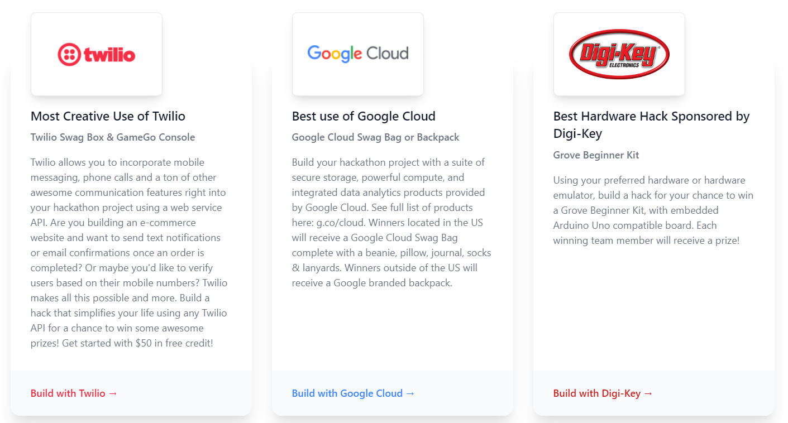
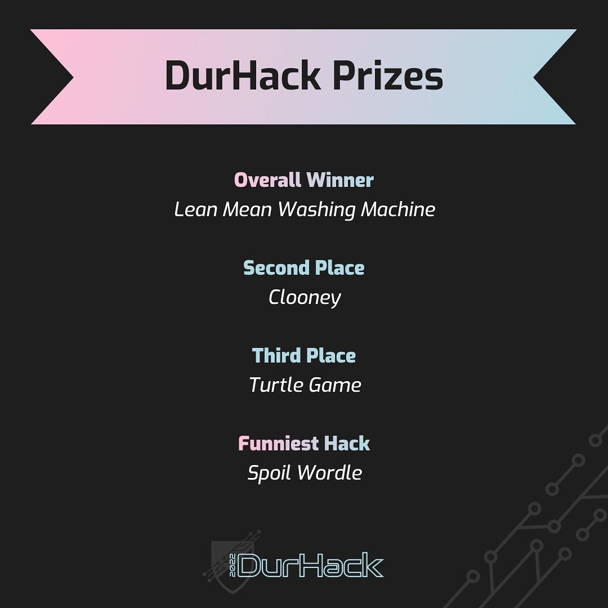
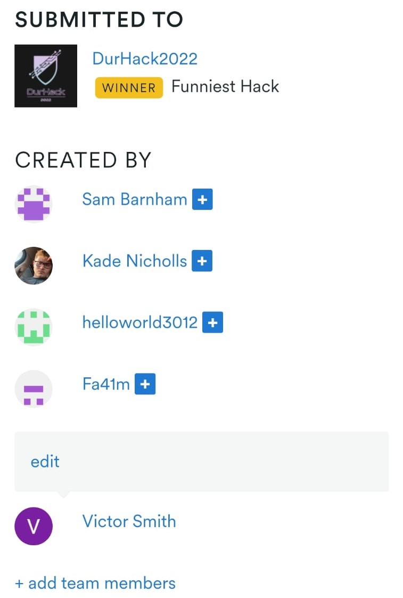
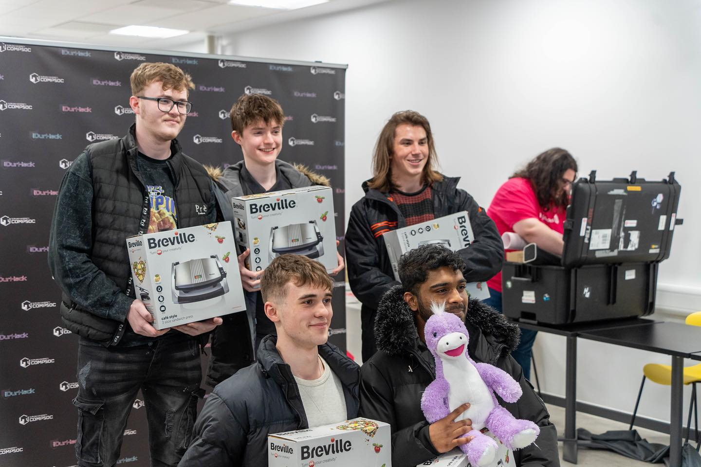

# Learning Log
(p.s. looks better in dark mode)
# Part 1 *DurHack 2022*

### *Project: Spoil Wordle*

When starting this project I felt lost. This is a problem I'm sure many have faced. It was only after DurHack that I knew what I wanted to achieve. 

I am breaking this project into parts in attempt to emphasize the importance a hackathon has in gaining the experience of what actual developing environments are like. Having interned at a start up I saw the ordered chaos that developing can be and being at a hackathon made me feel as if I was starting my own. 

>In my opinion a hackathon should be a mandatory aspect of this project and where better to start then DurHack. 

###  *My Guide to Hackathons ([DurHack](https://durhack.com/)):*

1. Read Challenges Before Hand

    If you have never been to a hackathon before there is a list of challenges that will be released before every hackathon. This is something I highly recommend you read before competing eg.

1. Build Your Team Beforehand 
    * Saves Time
    * You can build it better with diversity of skill in mind. Something you will be more limited in, building your team at an event.
    * You will spend lots of time together make sure you work well from the get go.
1. Rely on Sponsor Representatives
    * use Hackathons/Sponsors resources and engage with the Representatives. They are there to help! I found the lectures given the most informative and helpful.
1. The Demo
    * Let the best speaker present.
        * Explain why you made the project and the value it adds 

###  *Hackathon Tips (DurHack):*
* Rest before, these are long events don't burnout.
* Go in open minded, **your plans will change**.
* Choose a personal objective. 
    
    It's okay if it changes. I found this very useful especially when trying to learn something when there are so many options.
* Make a list of what your project must do and focus on core functionality before adding extra

### Motivation for our Hack:

All businesses require [communication channels email, text messages, phone calls](https://www.health.org.uk/sites/default/files/Communications-channels.pdf). As annoying as it is to call Amazon and select the 50 different options given to you before you can finally speak to someone, there is a reason businesses do this. It is incredibly efficient. These communications are not specific to customers, within a business it is also imperative for an efficient work environment. It is important to know how these communications can be done autonomously as it is **unavoidable**. This was my personal goal for DurHack.

### Background knowledge: 

Before starting with API's such as [Twilio](https://www.twilio.com/) or [alternatives](https://rigorousthemes.com/blog/best-twilio-alternatives/) You should attempt to work with more basic API's. I recommend [Gmail](https://developers.google.com/gmail/api/) as a good starting place before you attempt to jump into more complex combinations of communications. This is where I started and it is a route I recommend. Start by sending basic emails and categorizing emails received by their content/subject. [Tutorial using nodemailer](https://www.youtube.com/watch?v=vgk7Yio-GQw). 

### Spoil Wordle:

API's can differ drastically, some even having their own local languages. Twilio has [TwiML](https://www.twilio.com/docs/glossary/what-is-twilio-markup-language-twiml). Using this we were able to incorporate much greater functionality into our project [Spoil Wordle](https://github.com/sbarnham/spoilWordle) a website that allows you to enter number and then play wordle with the solution being sent to entered numbers via SMS's and call's. 

Using Twilio we were able to host Mp3's ([example](https://altaudio-9871.twil.io/3.mp3)) splicing them to generate unique and *human sounding* phone calls to each of the entered numbers. We created a response tree in TwiML reading and replying to messages sent to the phone numbers we controlled though Twilio. This would allow customers to access information they require, contact relevant company members able to help as well as other uses.

<Checking phone numbers>

Top 3 & Funniest Hack   | Spoil Wordle Team
-------------  | -------------
 |  

# Part 2  *Project: ScheduleYouLater*

One of the big issues I faced in the first practical of programming black was code quality. <While I marked well in code functionality> I did not realize how important this issue was until DurHack.

Often I would reach a point where I had a piece of code achieving what wanted but when others have had to read and interpret how that code actually works they would get lost. Much of my code might be called ***spaghetti code***, this was because of my approach . I would think about how I could solve the problem at hand not putting enough thought into problems such as.
1. Later development
    * Changing functionality
    * Adding extra functionality
    * Upgrading efficiency
    > This would mean even small changes of code or it's objective would take disproportionately long with simple tasks becoming complex.
1. Working with others
    * Understanding others code
    * Others understanding my code
    * Collaborating efficiently
1. Bug testing
    * Finding Bugs
    * Fixing Bugs without having to re-write
    * Having bugs disguise other bugs
    > This proved the most infuriating of the issues and I believe it is was my weakest link. This proved a meaningful motivator is strengthening my codes quality.

## How To Fix the Issue

as much of a cop out answer as it sounds being hard on yourself.

**USE COMMENTS IN YOUR CODE**

If there is a operation which is being used repeatedly throughout the code make a function for it. I have found this helps in 2 ways.
1. Decreases the total lines of code making it quicker to read and understand.
1. Helps identify where issues in the code lie. 

once you have sat with a issue for a while you get a greater insight to it. For others to interact with your code having full understanding of every single line is arduous and wastes time especially in scenarios such as hackathons where time becomes the main factor in what you can achieve.

### Motivation for our Hack:

### Background knowledge: 

### ScheduleYouLater: 

Motivation (10%): Why learn it?
Background (10%): What do you need to know before starting? Include
links to material to catch up. Make it clear who your target audience is
Learning materials (10%): Provide appropriate links to external
resources with commentary
Evaluation (10%):  How useful is the skill, compared with the effort of
learning it? What similar alternatives are there?

